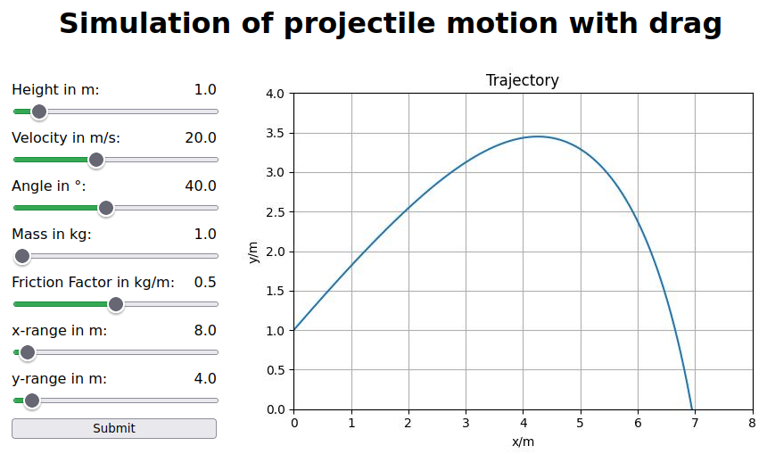

# Projectile Motion Simulation

This project uses [Django](https://www.djangoproject.com/) and [Docker](https://www.docker.com/) to display a simulation of an inclined projectile motion with air resistance in a web application.

## Overview

The simulation calculates the trajectory of a projectile under the influence of gravity and air resistance. It solves the following differential equation:
$$m\ddot{\vec{r}} = \vec{F}_G + \vec{F}_D$$
where the gravitational force $\vec{F}_G$ is given by
```math
\vec{F}_G = m\begin{pmatrix}0 \\ -g\end{pmatrix}
```
and the air drag force $\vec{F}_D$ is given by
```math
\vec{F}_D = -\frac{1}{2} c_F \left|\vec{v}\right| \begin{pmatrix}v_x \\v_y\end{pmatrix}.
```

## Features

- Simulation of projectile motion with adjustable initial conditions
- Realistic modeling of air resistance
- Interactive web interface to visualize the trajectory
- Easy setup with Docker

## Prerequisites

- [Python](https://www.python.org/) version 3.10.12
- [Docker](https://docs.docker.com/engine/install/)

## Setup

1. Clone the repository:
   ```sh
   git clone https://github.com/51moon/projectile_motion.git
   cd projectile_motion
   ```

2. Create and activate a virtual environment:
   ```sh
   python -m venv .venv
   source .venv/bin/activate
   ```

3. Build the Docker image:
   ```sh
   docker build -t projectile_motion .
   ```

4. Run the Docker container:
   ```sh
   docker run -it -p 8080:8080 projectile_motion
   ```

Now you can access the development server at [http://0.0.0.0:8080](http://0.0.0.0:8080).

## Preview

